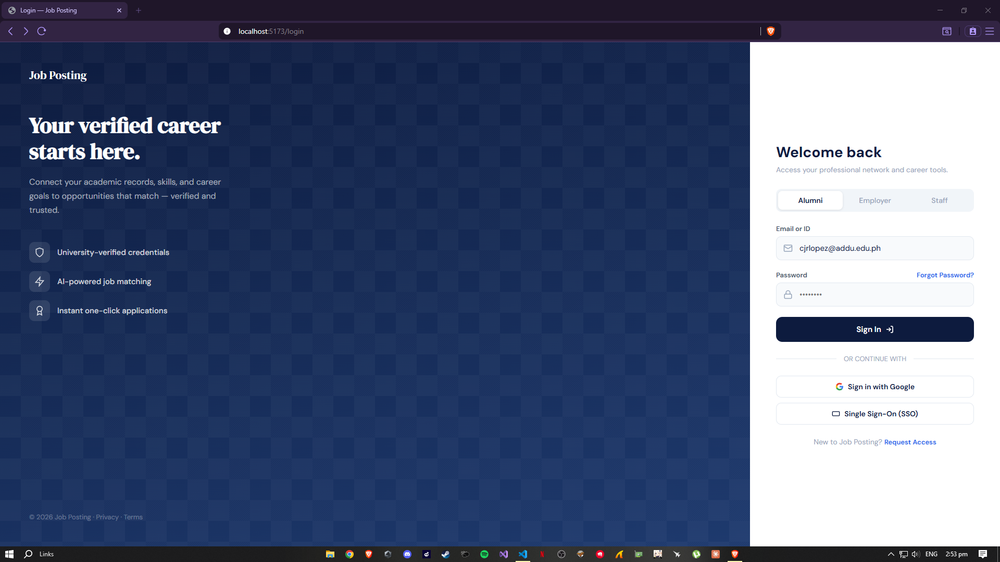
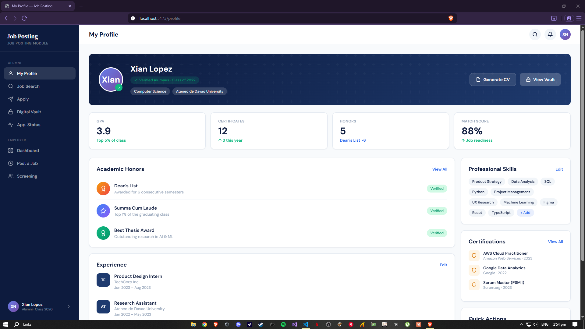
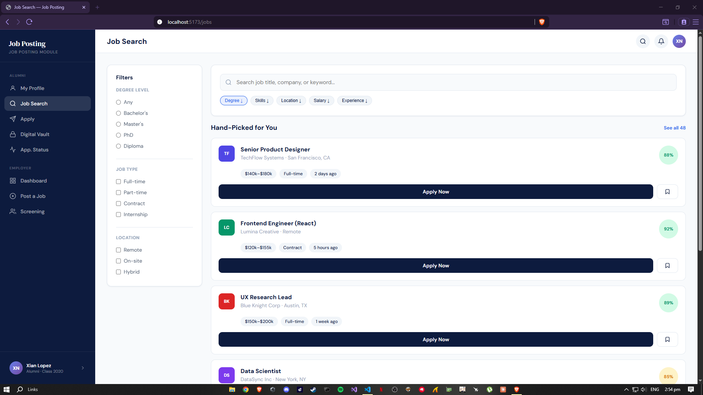
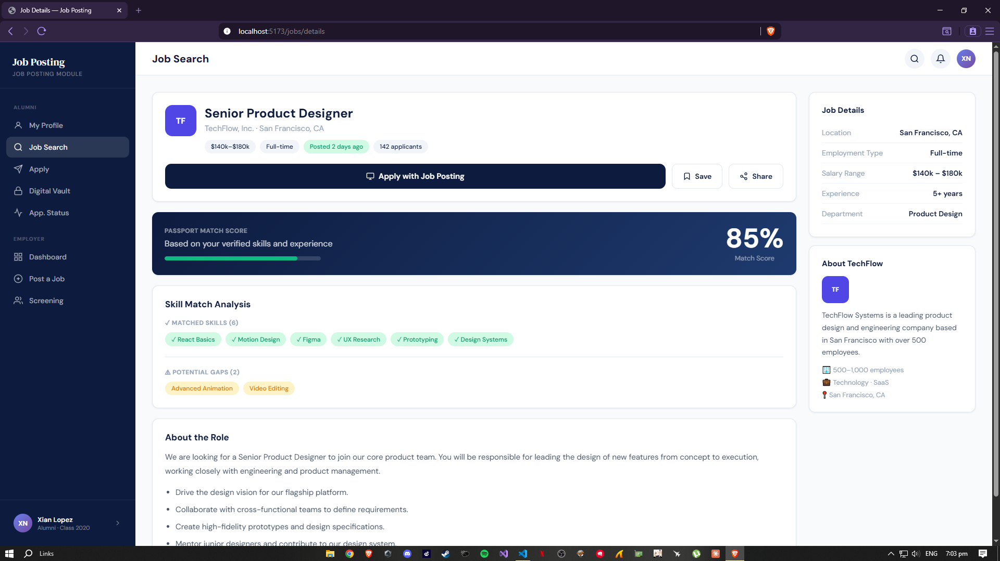
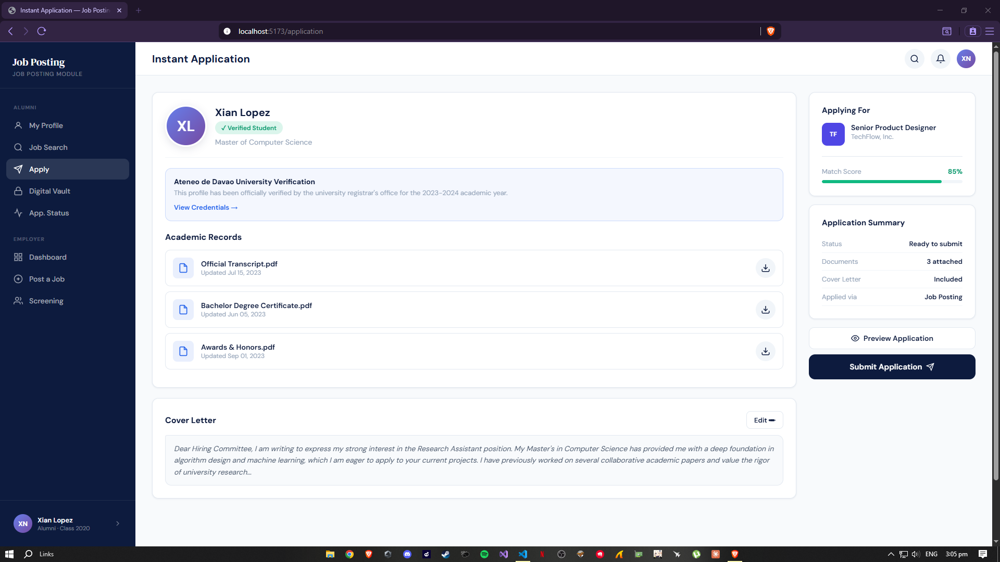
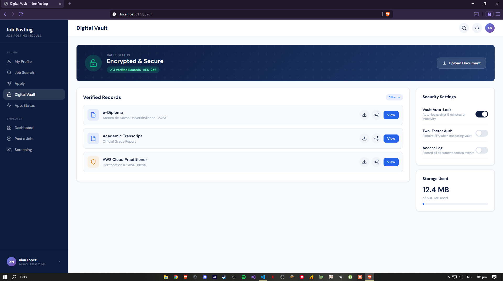
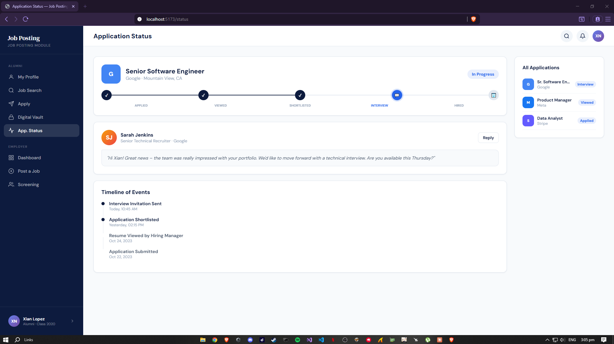
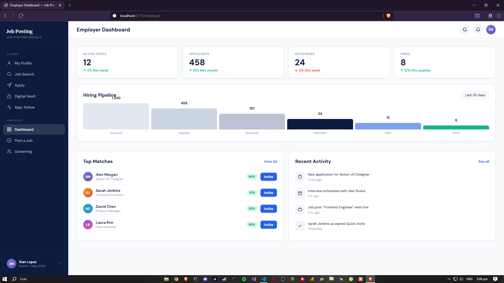
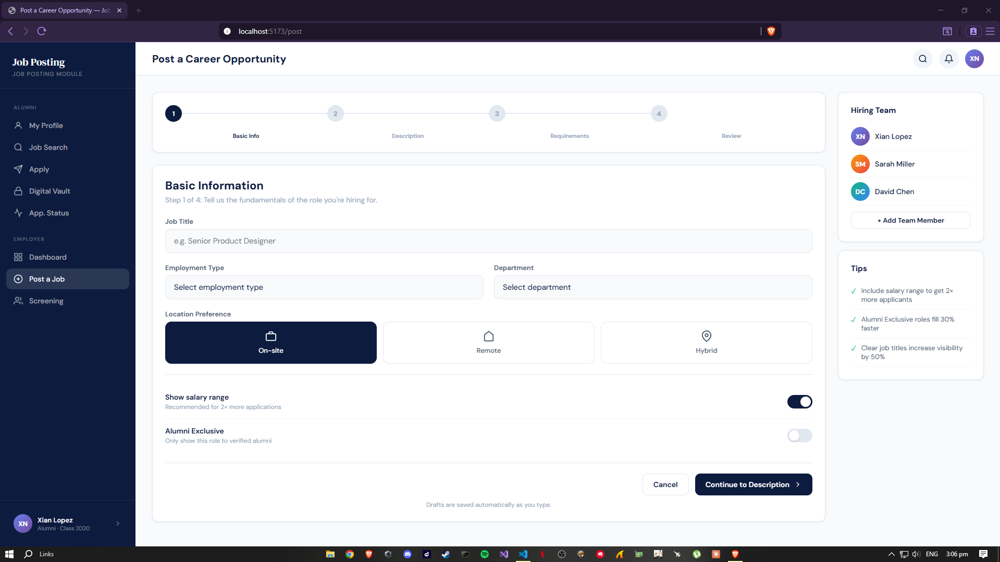
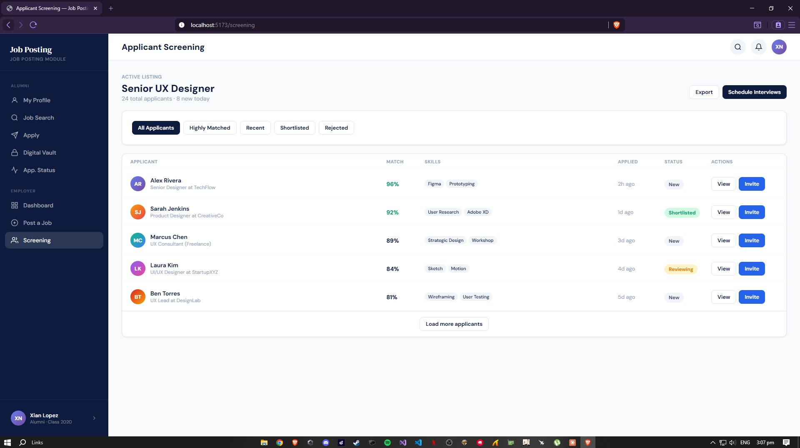

# Lopez

**Framework:** Svelte JS

**Module:** Job Posting

---

## 🚀 Installation

Prerequisites — Make sure the following are installed on your machine:
- [Node 18.13.0 or higher](https://nodejs.org) — required to run Svelte
- [Git](https://git-scm.com) — required to clone the repository

### Setup (Windows PowerShell)
To replicate and run this project, follow these steps:

### Install Node.js (LTS)
```bash
winget install OpenJS.NodeJS.LTS
```

### (Optional) Install and use Node Version Manager
```bash
nvm install lts
nvm use lts
```

### Clone the repository
```bash
git clone https://github.com/xianlope05/firstattempt2026_LOPEZ.git
```

### Navigate into the project directory
```bash
cd firstattempt2026_LOPEZ
```

### Install dependencies
```bash
npm install
```

### Start the development server
```bash
npm run dev
```

---

## AI Tools Used
- **Claude AI** (claude.ai) — used for all code generation and design

---

## Prompt

**First Prompt:**

"Create a complete SvelteKit web application called Job Posting for a Job Posting module. The app should be fully responsive on both desktop and mobile. The app should include the following pages:
1. Login Page - with tabs for Alumni, Employer, and Staff. Include Email/ID and Password fields, Forgot Password link, Sign In button, Sign in with Google, and Single Sign-On (SSO) options.
2. Alumni Profile/Passport Page - showing user profile photo, name, verified status, GPA, Certificates, Honors count, Academic Honors list, Professional Skills with tags, and a Generate Professional CV button.
3. Job Search Page - with search bar, filters (Degree, Skills, Location), and a list of hand-picked job cards showing job title, company, location, salary range, job type, match percentage, and Apply Now button.
4. Job Details Page - showing job info, Passport Match Score, Skill Match Analysis, About the Role description, Location, and Apply with Career Passport button.
5. Instant Application Page - showing applicant profile, university verification, academic records with downloadable files, cover letter, and Submit Application button.
6. Digital Vault Page - showing encrypted storage status and a list of verified records (diploma, transcript, certifications) with View and download options.
7. Application Status Page - showing application progress timeline with stages (Applied, Viewed, Shortlisted, Interview, Offer) and recruiter messages.
8. Employer Dashboard Page - showing active posts, applicants count, interviews, pipeline overview chart, and top matches with Quick Invite buttons.
9. Post a Career Opportunity Page - a multi-step form with Job Title, Employment Type, Location Preference (On-site, Remote, Hybrid), salary range toggle, and Alumni Exclusive toggle.
10. Applicant Screening Page - showing active listing, list of applicants with match percentage, skills tags, and View Profile buttons.
Use a dark navy blue and white color scheme consistent throughout. Add a bottom navigation bar on mobile with icons for Search, Applied, Messages, and Profile."

## PWA Conversion Log

### Master Prompt (PWA)
"I am building a Career Passport job posting app using SvelteKit. 
I need to convert it into a fully offline-ready Progressive Web 
Application (PWA). Help me generate a valid manifest.json with 
university branding, register a Service Worker, implement caching 
so the app works offline, and tell me where to place my app icons."

### AI Tool Used
Claude (claude.ai) — claude.ai/chat

### Hallucinations / Manual Fixes

1. **Invalid icon purpose field** — Claude wrote `"purpose": "any maskable"` 
   as a combined string in one icon entry. This is invalid. Fixed by 
   separating into two icon objects with individual purpose values.

2. **Stale build cache** — Manifest syntax error persisted after fixing 
   the JSON because the old broken version was cached in `.svelte-kit/`. 
   Fixed by running `npx rimraf .svelte-kit` before rebuilding.

3. **Missing favicon link** — Claude did not initially include 
   `<link rel="icon" href="/favicon.ico" />` in app.html, causing 
   a [404] GET /favicon.ico error. Added manually.

4. **Dev mode vs Preview mode** — Tested in `npm run dev` which does 
   not fully support PWA service workers. Had to switch to 
   `npm run build && npm run preview` for proper PWA testing.

**File Attachments:** 10 UI mockup screenshots (PNG images of each screen design)
---

#### Screenshots

### Login Screen


### Alumni Profile


### Job Search


### Job Details


### Instant Application


### Digital Vault


### Application Status


### Employer Dashboard


### Post a Job


### Applicant Screening

